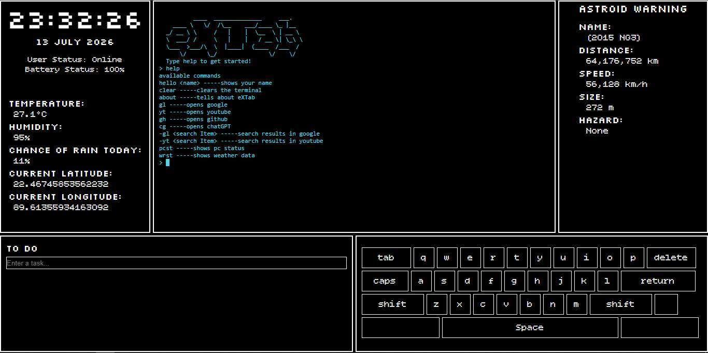
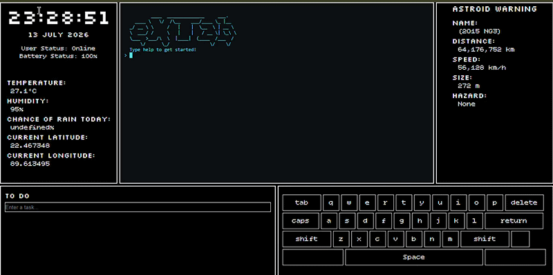

# eXTab
eXTab is a eDex-Ui inspired new tab page made by me! it has a simple terminal where you can directly open google, youtube, github etc. or you can search with google or youtube. there are some other fun commands too!

## how to use it and features
Upon opening the website you will be introduced with a terminal like interface in the center there are some other information around the terminal.

1. in the terminal tpye **help** to see available commans.
2. on the left bar you will be able to see the current time.
3. below the clock you will see the battery and network status of your device.
4. in the left bar you will also be albe to see your current locations weather. (if you allow the page to use you location which it will ask for permissin at start)
5. below the left bar there is a todo list where you can create task and tick it after you are done.
6. in the right bar there is the daily astroid data from nasa its a cool touch to the page!
7. below the right bar there is a virtual keyboard which you can use to type!

## Screenshot and gif of tha page!

## how i made it?
It is made with html, css and javascript. I used jQuery for the terminal and 
